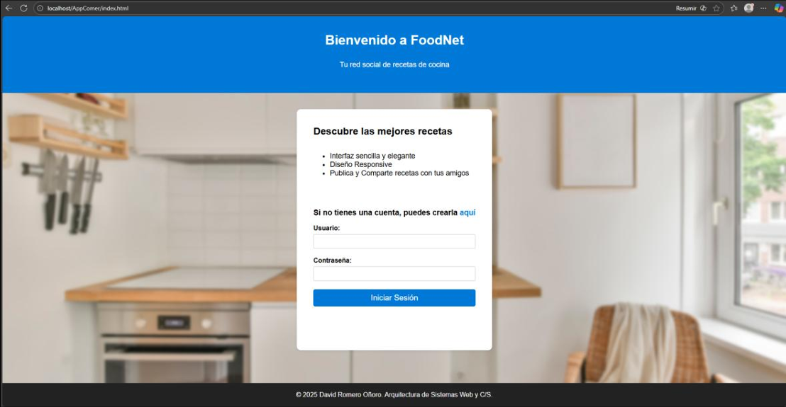
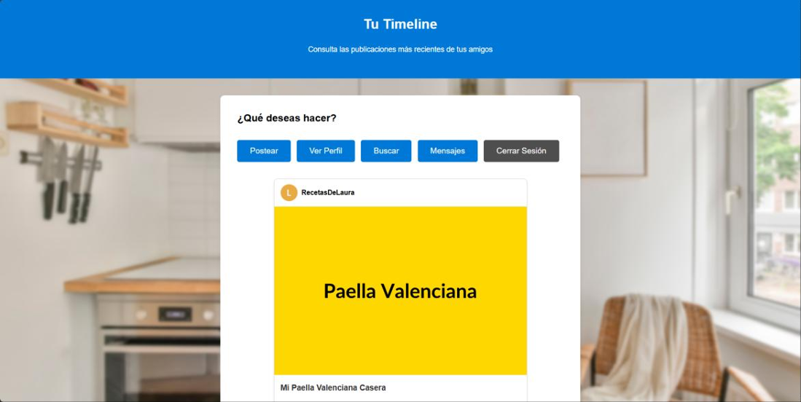

## 🍳 FoodNet: Red Social de Cocina

  

## 📖 Descripción del Proyecto
Este repositorio contiene el código fuente completo de la aplicación **FoodNet**, una red social diseñada para amantes de la cocina, desarrollada a lo largo de las Prácticas 1 y 2 de la asignatura **Arquitectura y Diseño de Sistemas Web y C/S**. 

El proyecto abarca desde el diseño inicial del *frontend* responsivo (HTML5, CSS3, JavaScript) hasta la implementación de una arquitectura de servidor robusta y escalable (Backend) aplicando el patrón **Modelo-Vista-Controlador (MVC)** con tecnologías Java Enterprise Edition (JEE). La plataforma permite a los usuarios registrarse, compartir recetas, interactuar socialmente (seguir a otros usuarios, dar likes, comentar), enviar mensajes privados y gestionar sus perfiles.

  

## ⭐ Características Principales

### Frontend (Presentación y UX)
* **Diseño Responsivo e Interfaz de Usuario:** Maquetación estructurada con HTML5 semántico y CSS3, asegurando adaptabilidad a diferentes resoluciones de pantalla.
* **Modo Oscuro (Dark Mode):** Sistema dinámico de cambio de tema (`dark-mode.js` y `Dark-styles.css`) con persistencia en *localStorage* para recordar la preferencia del usuario.
* **Componentes Dinámicos (JavaScript Vanilla):**
    * Ventanas modales emergentes (*Modals*) para la creación de recetas, publicación de comentarios y envío de mensajes privados.
    * Validación asíncrona de formularios en tiempo real (ej. coincidencia de contraseñas y expresiones regulares para emails).
    * Filtrado instantáneo de búsquedas en el cliente (`search-results.js`) sin necesidad de recargar la página.
* **Validación W3C:** Todas las plantillas base han superado satisfactoriamente los test de validación estándar de la W3C.

### Backend (Lógica de Servidor MVC)
* **Arquitectura MVC Pura:** Separación estricta entre la lógica de presentación (JSP), la lógica de negocio (Servlets) y el acceso a datos (Objetos DAO).
* **Gestión de Sesiones y Seguridad:** Implementación de control de acceso mediante `HttpSession`, diferenciando entre usuarios estándar y administradores (Panel Admin exclusivo).
* **API RESTful (Servlet-based):** Mapeo de rutas HTTP (`/registro`, `/login`, `/timeline`, `/publicar`, etc.) gestionadas mediante servlets (`HttpServlet`) que despachan peticiones `GET` (lectura y carga de vistas con *Forward*) y `POST` (modificación de datos y *Redirect*).
* **Manejo Dinámico de Archivos:** Subida y servido de imágenes de perfil y recetas utilizando la anotación `@MultipartConfig` y un Servlet especializado (`ImagenesServlet`) que actúa como puente para leer binarios directamente desde el sistema de archivos del servidor (p. ej. `C://foodnet_fotos`).
* **Interacción Social Compleja:** Implementación de relaciones lógicas para funcionalidades como seguimiento de usuarios ("Followers"), sistema de "Me Gusta" y comentarios en tiempo real.

## 🗂️ Estructura del Código y Patrón MVC

### 1. Modelo (Entity & DAO)
Ubicado en el paquete `com.mycompany.foodnet.modelo`. Gestiona la persistencia, la integridad relacional y la comunicación con la BBDD **Apache Derby**.
* **Entidades:** Clases Plain Old Java Objects (POJOs) como `Usuario`, `Receta`, `Mensaje` y `Comentario` que mapean la estructura relacional.
* **Data Access Objects (DAO):** Clases (`UsuarioDAO`, `RecetaDAO`, `MensajeDAO`) que centralizan el uso de la API JDBC para aislar las consultas SQL (CRUD) y la lógica de base de datos.
* **Conexión:** Gestión eficiente del ciclo de vida de la conexión a Derby para evitar bloqueos del servidor.

### 2. Vista (JSP & HTML)
Archivos estáticos (`.html`) iniciales y motores de plantillas (`.jsp`) en el directorio principal web.
* Las páginas de la Parte 1 (ej. `timeline.html`, `profile.html`) han evolucionado a JavaServer Pages (`timeline.jsp`, `profile.jsp`).
* El contenido se renderiza dinámicamente inyectando objetos Java (listas, información de sesión) a través del `Request Scope` (ej. `request.setAttribute("listaRecetas", lista)`).
* Diferenciación de perfiles: `profile.jsp` (perfil privado para editar) vs `public-profile.jsp` (perfil de terceros para seguir).

### 3. Controlador (Servlets)
Ubicado en el paquete `com.mycompany.foodnet.controlador`.
* Clases que actúan como directores de orquesta: extraen parámetros del usuario (`request.getParameter()`), invocan al Modelo (DAOs) aplicando seguridad/validaciones, y redirigen el flujo hacia la Vista adecuada.

## 💾 Base de Datos y Despliegue
* **Base de Datos Apache Derby:** El proyecto incluye scripts SQL de inicialización (DML y DDL) para crear el esquema relacional `foodnet_db` y popularlo con datos ficticios (Mock Data).
    * Tablas principales: `USUARIOS`, `RECETAS`, `COMENTARIOS`, `MENSAJES`, `LIKES` y `SEGUIDORES` (Relación reflexiva para amistades).
* **Despliegue:** La aplicación está configurada para compilarse y desplegarse sobre el servidor de aplicaciones **Apache Tomcat (v10+)**.
